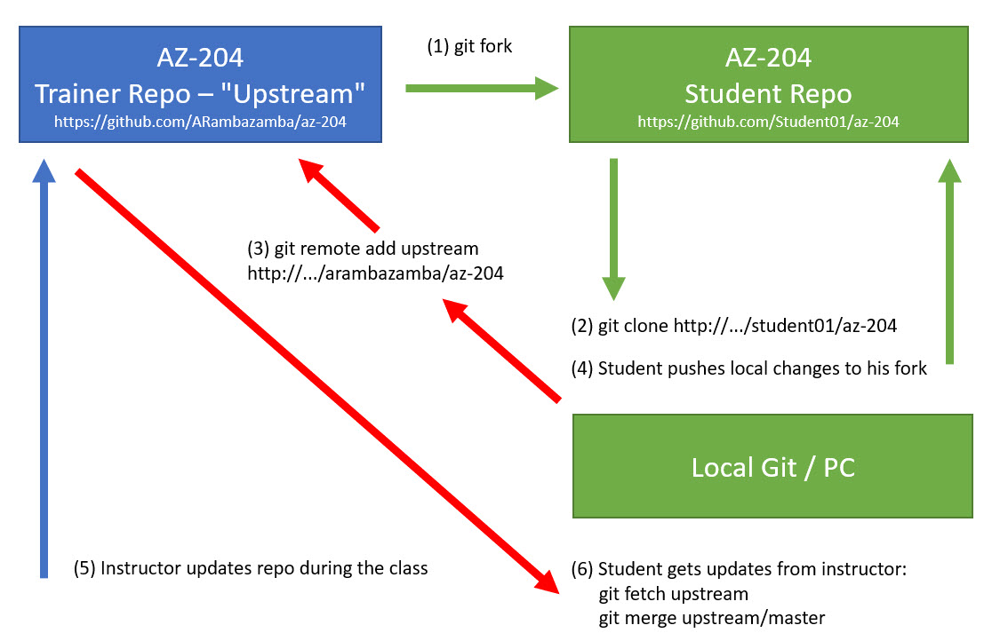

# Git / Github Essentials

## Links

[Git Bash Download](https://git-scm.com/downloads)

[Git Extensions for Windows](https://sourceforge.net/projects/gitextensions/)

[Git Graph VS Code](https://marketplace.visualstudio.com/items?itemName=mhutchie.git-graph)

[Git History Diff](https://marketplace.visualstudio.com/items?itemName=huizhou.githd)

## Configuration

Set User and E-Mail

`git config --global user.name "Your Name"`

`git config --global user.email "your.email@yourdomain.com`

Unset Credentials

`git config --global --unset credential.helper`

## Basic Git Commands

Init Git: `git init`

Add all files to Git: `git add .`

Add a specific file to Git: `git add file.txt | *.ts`

Commit files: `git commit -m "your checkin comment"`

Get a spcific Commit: `git checkout <sha1>`

## Status & Updates

Show Commit logs: `git log`

Check for remote updates: `git remote update`

Show Status (Adds/Delets/Changes): `git status`

## Branching

List Branches: `git branch`

Create Branch: git branch feature/myfeature

Push new Branch to remote: `git push origin [name_of_your_new_branch]`

Switch to Branch: `git checkout [name_of_your_branch]`

Merge Branch: `git merge [branch_to_merge]`

## Remotes

Adding Remotes: `git remote add origin https://github.com/try-git/try_git.git`

Pull / Push from / to repository: `git pull / git push`

## Tags

Create Lightweight tag : `git tag -l v1.1.0`

Create Annotated tag : `git tag -a v2.0.1 -m "fixed Bug on replaced data layer. do not use v.2.0.0"`

List all tags: `git tag`

Show a specific tag: `git show v2.0.1`

Push tags to Remote: `git push origin v2.0.1 | git push --tags`

Delete tag: `git tag -d v2.0.1`

Checkout tag: `git checkout 2.0.1`

## Configure ignored files

Add a `.gitignore` file to the root of your project. A valid `.gitignore` file can be generated at https://www.gitignore.io/

## Forking Workflow - Getting Updates for Class Demos



Original Repo could be: `https://github.com/ARambazamba/AZ-204` where `ARambazamba` is the `original-owner-github-username` and `AZ-204` is the `reponame`

### Listing the current Remotes

List the current configured remote repository for your fork.

```
git remote -v
> origin  https://github.com/your-github-username/reponame.git (fetch)
> origin  https://github.com/your-github-username/reponame.git (push)
```

Specify a new remote upstream repository that will be synced with the fork.

### Adding the Repo of the original owner as Upstream

```
git remote add upstream https://github.com/original-owner-github-username/reponame.git
```

Verify the new upstream repository you've specified for your fork.

```
git remote -v
> origin    https://github.com/your-github-username/reponame.git (fetch)
> origin    https://github.com/your-github-username/reponame.git (push)
> upstream  https://github.com/original-owner-github-username/reponame.git (fetch)
> upstream  https://github.com/original-owner-github-username/reponame.git (push)
```

### Getting Updates

Fetch from Upstream:

```
 git fetch upstream
 git merge upstream/main
 git push origin main
```
