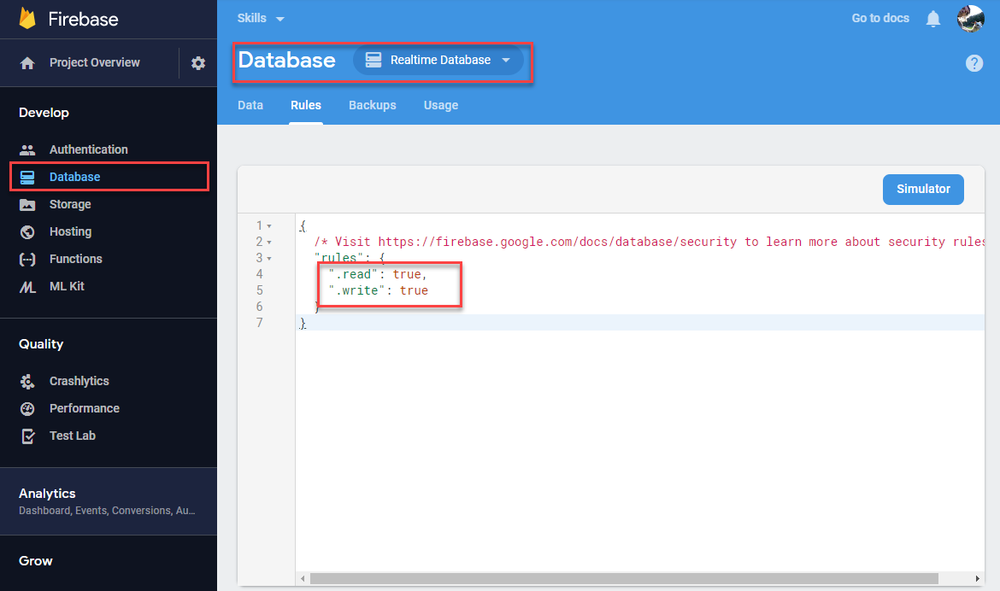
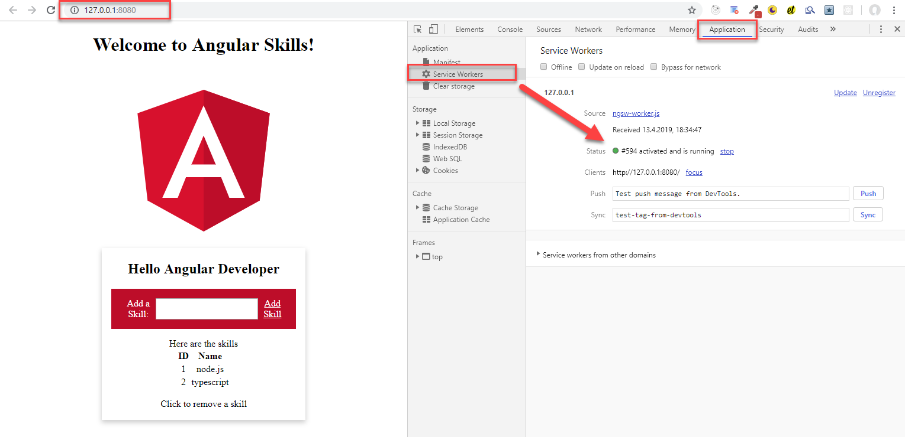
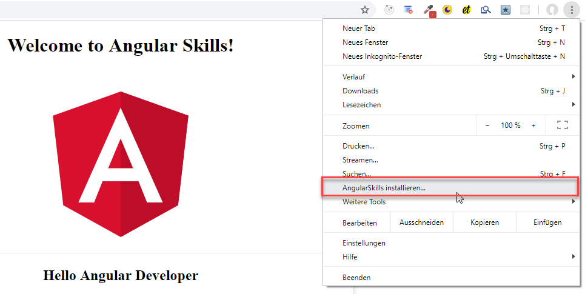
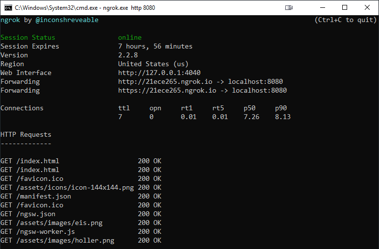

# Progressive Web Apps

## Prerequisites: Skills REST Api from folder

Requires [.NET Core SDK v3.1.301](https://dotnet.microsoft.com/download/dotnet-core/thank-you/sdk-3.1.301-windows-x64-installer). You can use SQL Standard or Enterprise - change connection string in appsettings.json.

Go to folder where `*.csproj` is located, open console and run:

`dotnet restore` and then  
`dotnet run`

For device testing it might be helpful to enable remote access - by default the .Net Core API is only available using `http://localhost:PORT/` and is not listening to the ip of your dev machine.

`dotnet run --urls http://0.0.0.0:5000` or
`dotnet run --urls https://0.0.0.0:5001`

---

## Setup & Gettings started

### Create Project with Service Worker

```
ng new ngSkillsPWA
cd ngSkillsPWA
ng add @angular/pwa --project ngSkillsPWA
```

Make sure you adjust your `environment.prod` to match IP config of your dev machine

```
export const environment = {
  production: true,
  apiURL: "https://API_DNS-or-IP/api/"
};
```

Create a prod build

```
ng build --prod [--watch] [--delete-output-path false]
```

## Deploy to Firebase

```
npm i -g firebase-tools
firebase login
firebase init
firebase deploy
```

### Firebase Messaging

Test Messaging from Firebase:


Test Messaging - execute in Console:

```
curl -X POST \
  https://fcm.googleapis.com/fcm/send \
  -H 'Authorization: key=YOUR-SERVER-KEY' \
  -H 'Content-Type: application/json' \
  -d '{
 "notification": {
  "title": "Hello World",
  "body": "This is Message from Admin"
 },
 "to" : "YOUR-GENERATED-TOKEN"
}'
```

> YOUR-SERVER-KEY : Find out in Firebase console by open Setting > Cloud Messaging.


> YOUR-GENERATED-TOKEN : you can find out in browser console because we log it in


> Make sure you change token db to real time db



## Tools

### Angular-Http-Server

Can be used to serve your Angular Production Build

```
npm install -g angular-http-server
ng build --prod
cd .\dist\skillspwa\
angular-http-server
```

#### Use loopback

No cert is needed to register service worker



PWA can be installed



#### Use ngrok


[ngrok](https://ngrok.com/) is a tool that provides an `https-secured tunnel` to `localhost` that enables
testing your PWAs. Requires registration but is free.

```
ngrok.exe http 8080
```



### Other Tools

[Open Port Detection Tool](https://www.yougetsignal.com/tools/open-ports/)

[Getting Started with Lighthouse](https://developers.google.com/web/tools/lighthouse/)

---

## Links & Readings

[Let's encript](https://letsencrypt.org/)

[Certify the Web - IIS Tool](https://certifytheweb.com)

[manifest.json Reference](https://developers.google.com/web/fundamentals/web-app-manifest/)

[Create \*.pem-Certificate](https://www.cloudinsidr.com/content/how-to-install-the-most-recent-version-of-openssl-on-windows-10-in-64-bit/)

[Debugging Service Workers](https://developers.google.com/web/fundamentals/codelabs/debugging-service-workers/)
